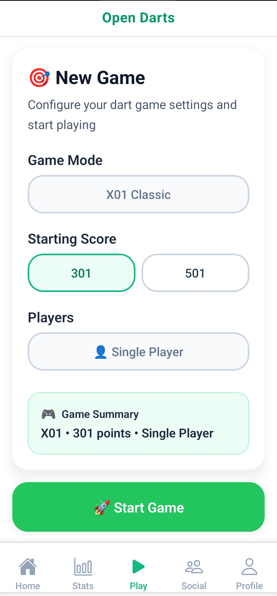

# OpenDarts

A mobile application for playing darts games with automatic scoring using your camera and data synchronization with the OpenDarts backend.

## Features

- Automatic score detection through camera
- Multiple game modes including 301, 501 and more
- Real-time score tracking
- Player statistics and history

## Game Selection

Choose from different game modes and set up your match.

## In Game View

Track scores and game progress in real-time with automatic scoring from camera detection. All game data is synchronized with the OpenDarts backend for persistent storage and statistics.

